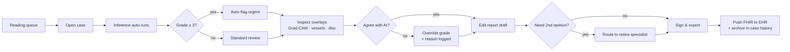
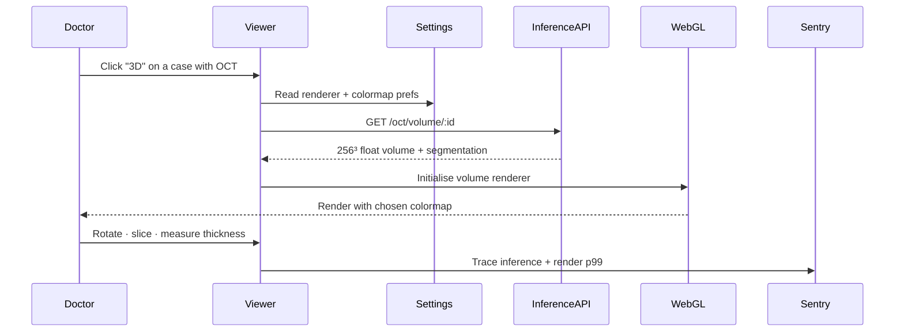
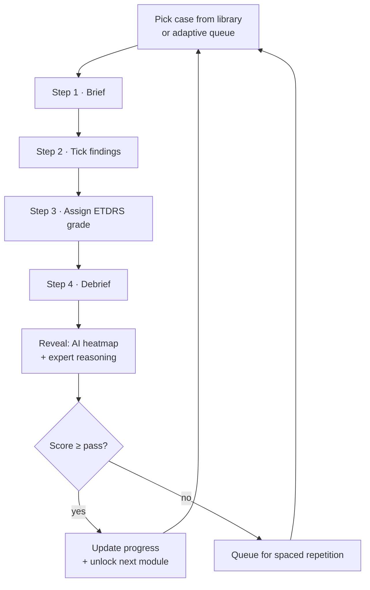
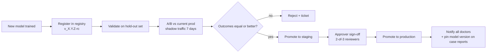
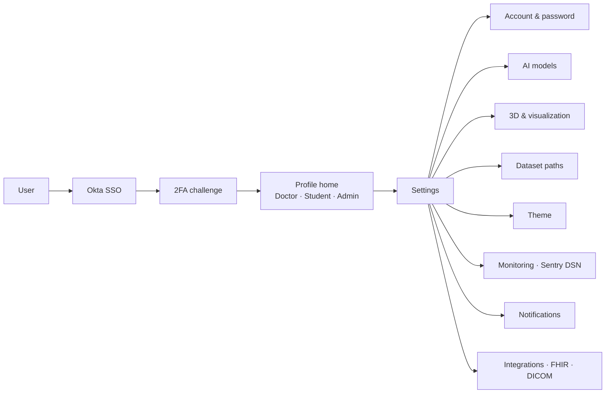

# Octopus AI — Design System

> Intelligent Retinal Disease Diagnosis Platform.
> A multi-role clinical intelligence platform for the detection, diagnosis, and staged grading of diabetic retinopathy and other retinal pathologies (AMD, glaucoma, RVO, macular oedema).

This folder is the **single source of visual truth** for the Octopus AI product. It contains color/type tokens, brand assets, iconography rules, copy guidelines, and high-fidelity UI kits for all three user surfaces (Doctor, Student, Admin).

---

## Product context

Octopus AI is a cloud-native, microservices-based clinical platform with three distinct user journeys:

| Persona | Module | Primary jobs |
|---|---|---|
| **Dr. Amina** — Ophthalmologist / GP | **Clinical Diagnosis** | Upload fundus images → review AI-assisted DR grade (5-level ETDRS), heatmaps, vessel morphology → countersign report |
| **Karim** — Med student / intern | **Simulation & Learning** | Work through curated case library, practise grading on labelled fundus images, take assessments, track progress |
| **Fatima** — Platform admin / curator | **Administration** | Curate datasets, manage annotation workflows, configure assessments, govern users, manage AI model lifecycle |

**Reference frontend stack** (per PRD §7.2): Next.js 14 (SSR/SSG) on top of React 18 + TypeScript, **Tailwind CSS + Radix UI primitives** (and Hero UI components per the user's note). All UI kits in this design system mock that stack.

**Reference clinical surfaces:** the AI inference pipeline returns a DR grade (No DR / Mild / Moderate / Severe / Proliferative), a Grad-CAM++ heatmap, vessel segmentation mask, and morphology metrics (A:V ratio, tortuosity, fractal dim). Severity is the most semantically loaded dimension in the product — the design system gives it its own first-class color ramp.

---

## Sources

| Source | What it gave us |
|---|---|
| Product PRD (Octopus AI) | Product scope, personas, requirements, tech stack, glossary |
| User brief (chat) | Three-profile menu structure, clinical features per role, frontend stack confirmation |

> No existing brand book, Figma file, or reference codebase was provided for the **product UI itself**. The visual identity in this design system was therefore designed from first principles to fit the clinical / AI-imaging domain. **Caveat:** when the user has reference designs (a Figma library, a logo from a design agency, etc.), they should replace the placeholder logo and re-anchor the palette.

---

## Index — what's in this folder

```
README.md                  ← you are here
SKILL.md                   ← cross-compatible Agent Skill manifest
colors_and_type.css        ← all design tokens (CSS vars), light + dark
assets/
  logo-mark.svg            ← brand mark (concentric optic disc)
  logo-wordmark.svg        ← horizontal lockup
  fundus-sample-1.svg      ← placeholder fundus image
  fundus-sample-heatmap.svg← placeholder Grad-CAM overlay
  vessel-mask.svg          ← placeholder vessel segmentation
web/
  index.html               ← Landing + auth (entry point)
  _shared.jsx              ← Logo, Icon, RailBrand, RailItem, RailUser, TopBar, Pill, SeverityBar
  _shell.css               ← shared rail / topbar / button / pill chrome
  doctor/                  ← Clinical Diagnosis (queue · dark canvas · AI panel · report)
    {index.html, app.jsx, app.css, README.md}
  student/                 ← Simulation & Learning (4-step case sim + progress dashboard)
    {index.html, app.jsx, app.css, README.md}
  admin/                   ← Administration (users · datasets · model registry)
    {index.html, app.jsx, app.css, README.md}
```

### Using this design system

- **Production code:** import `colors_and_type.css` once at the app root, then use the CSS vars and the rules in **VISUAL FOUNDATIONS** below to compose components in Next.js + Tailwind + Hero UI / Radix.
- **Mocks &amp; prototypes:** open any UI kit's `index.html` for a working pixel-faithful starting point — copy components out into a new HTML file and adapt.
- **The Design System tab** in this project shows registered cards (typography, color ramps, spacing, components, brand).

---

## CONTENT FUNDAMENTALS — voice, tone, copy

Octopus AI is a **clinical instrument**, not a consumer app. Copy must read as if it were authored by a senior ophthalmologist and reviewed by a regulatory officer.

**Voice.** Calm, exact, observational. Never alarmist, never cute. Every word earns its place — clinicians scan, they don't read.

**Tone register by surface:**
- Doctor surface — peer-to-peer professional. *"AI-suggested grade. Review and countersign before exporting."*
- Student surface — supportive but academic. *"Compare your annotations to the expert overlay. Three lesions remain unidentified."*
- Admin surface — operational, neutral. *"Dataset v3.2 promoted to production. 12,847 images included."*
- Marketing / external — restrained, evidence-forward. Lead with metrics (AUROC ≥ 0.95, Dice ≥ 0.85), not adjectives.

**Person.** Use third-person clinical phrasing where possible (*"The model identified…"*, *"This case shows…"*). Use second-person ("you") sparingly, only for direct task instructions (*"Upload a fundus image to begin."*). Never first-person ("we"/"our") inside the product UI — it sounds like marketing.

**Casing.**
- Sentence case for everything in-product (buttons, headings, menu items): *"Generate report"*, not *"Generate Report"*.
- ALL-CAPS only for the eyebrow micro-label rendered in IBM Plex Mono with letter-spacing — used for section markers (e.g. `CLINICAL DIAGNOSIS`, `AI ANALYSIS`).
- Acronyms keep their canonical form: **DR**, **AMD**, **RVO**, **DICOM**, **FHIR**, **ETDRS**, **Grad-CAM**.

**Numbers.** Always render measurements in monospace with tabular figures: `0.93 AUROC`, `1.42 A:V`, `4.7s inference`. Confidence scores show one decimal: `92.4%`. Never round severity counts.

**Emoji.** **None.** Not in product, not in marketing, not in error states. Emoji is unprofessional in a clinical tool and breaks DICOM-adjacent screenshots.

**Examples — preferred:**
- *"AI-assisted grade — pending physician review"*
- *"3 microaneurysms detected in the inferior temporal quadrant"*
- *"This case requires consensus. 2 of 3 reviewers disagree."*
- *"Dataset v4.0 — 14,221 images, 6 expert annotators"*

**Examples — avoid:**
- ❌ *"Awesome! Your scan is ready 🎉"* (cute, emoji)
- ❌ *"We've analyzed your image"* (first-person plural in product)
- ❌ *"Click here to view results"* (web cliché — use direct verbs)
- ❌ *"Severe DR detected!!"* (alarmist punctuation)

**Vibe in one line.** *"The instrument speaks like a colleague who's already seen ten thousand of these and is showing you the third."*

---

## VISUAL FOUNDATIONS

### Colors

Three families, each with a job:

1. **Ocular Teal** (brand). Modeled in OKLCH for perceptual evenness. `--rs-teal-600` is the primary action color. Used sparingly — clinical UIs are white-and-ink most of the time and let teal accent only where decisions happen.
2. **Warm graphite ink** (neutrals). The whole system avoids true black and pure gray; all neutrals carry a slight warm undertone (paper, not screen). `--rs-ink-50` is the page background — it reads as off-white but warmer than #FAFAFA.
3. **Severity ramp** (No DR → Proliferative). The single most important *semantic* dimension. Each grade has a foreground and a tinted background; never use raw red without its tint.

A **separate dark-canvas family** (`--rs-canvas-*`) is used only inside image viewers, where fundus images live. Switching to the dark canvas is a deliberate context shift, like turning off the room lights to read a chest X-ray. Clinicians know this convention.

**AI-overlay colors** (`--rs-overlay-magenta`, `--rs-overlay-cyan`) are reserved exclusively for AI output — heatmaps, vessel traces, AI-action badges. Never use them for general UI.

### Typography

- **IBM Plex Sans** (300/400/500/600/700) — UI and body. Chosen for its slightly humanist feel inside an otherwise grotesque silhouette; reads as precise but not sterile, and was literally designed for instrument panels.
- **IBM Plex Mono** (400/500) — measurements, IDs, codes, eyebrow labels. With `font-feature-settings: "tnum", "zero"` so values align in tables.
- **Instrument Serif** (italic moments) — used only for editorial/display moments: hero quotes, section dividers in marketing, the "Why this matters" callout in onboarding. Never inside dense product UI.

Minimum sizes: **15px body**, **13px dense table text**, **24pt minimum on slides**. Eyebrow labels (11px Plex Mono uppercase, 0.14em tracking) are the *only* exception below 13px and only render at very high contrast.

### Layout & spacing

- **4px base grid.** Component padding is always a token (`--rs-space-2` through `--rs-space-7`), never an arbitrary value.
- **Density.** This is a clinical tool — density beats whitespace. Table rows are 36–40px tall, not 64px. List items breathe with `--rs-space-3` (12px) gap, not 24px.
- **Layout shells.** App surfaces use a fixed 240px left rail (collapsible to 64px), a 56px top bar, and a fluid main area. Image viewers go edge-to-edge.

### Backgrounds

- **App default:** flat warm off-white (`--rs-ink-50`). No gradients, no textures.
- **Image rooms:** flat near-black (`--rs-canvas-900`). No gradients here either — gradients distort fundus image perception.
- **Marketing only:** a single subtle radial wash (teal, very low opacity) is permitted on hero sections. Never on product chrome.
- **No hand-drawn illustrations, no isometric scenes.** Imagery in the product is real fundus photography or vector medical diagrams. Marketing uses real clinical photography (warm, slightly desaturated) — never stock office shots.

### Animation & motion

Short, controlled, never bouncy.

- Hover/press: `--rs-dur-fast` (140ms), `--rs-ease-out`.
- Panel/menu enter: `--rs-dur-base` (220ms), `--rs-ease-out`.
- Page transitions: `--rs-dur-slow` (360ms) cross-fade only.
- No spring physics, no bounce, no scale-up-on-hover. The single allowed "delight" motion is the AI-inference progress indicator (a 1.6s breathing ring around the optic-disc mark while results stream in).

### Hover & press states

- **Hover (text/links):** color shift only, no underline (links inside paragraphs get an underline on hover, never default).
- **Hover (buttons):** background shifts one step deeper on the brand ramp (`--rs-teal-600` → `--rs-teal-700`).
- **Hover (rows):** `--rs-bg-sunken` background appears.
- **Press:** the same color one step deeper *plus* a 1px inset shadow — no shrink, no scale.
- **Disabled:** 40% opacity, no pointer events.
- **Focus:** always a 3px outer ring at `--rs-focus-ring` (teal at 45% alpha). Never remove the focus ring — clinicians use keyboard.

### Borders, shadows, cards

- **Borders are the primary container language**, not shadows. `1px solid var(--rs-border)` defines almost every card and panel.
- Shadows only appear on **floating** surfaces: dropdowns, popovers, toasts, modal scrims. Five elevation steps (`--rs-shadow-1` through `--rs-shadow-4`).
- **Card anatomy.** Default card: `1px solid var(--rs-border)`, `--rs-radius-lg` (10px), `--rs-bg-raised` (white) on the warm-paper page. **No left-border-accent cards.** No drop shadow on default cards.
- **Inset shadow** (`--rs-shadow-inset`) is used to mark a selected/active state — pairs with a teal background tint.

### Radii

Restrained: 2/4/6/10/14px and a pill. We never round above 14px on functional containers; 10px is the default. Avatars, status dots and pills use the pill radius.

### Transparency & blur

Used **only** in two places:
1. The dark-canvas image viewer's floating tool palette (10% white, 12px backdrop-blur).
2. The "AI is thinking" overlay on a fundus tile (8% teal, no blur).

No glassmorphism on light surfaces. No frosted nav bars.

### Imagery

- **Clinical imagery:** real fundus photography, displayed unmodified except for AI overlays. Never tinted, never cropped to circles, never put behind decorative shapes.
- **Marketing imagery:** real photography of clinicians at workstations — warm, slightly desaturated, no heavy filter. No stock "happy office worker" shots, no abstract "tech" renders, no AI-generated faces.
- **No grain, no duotone, no overlay tints.**

### Layout rules / fixed elements

- The brand mark sits in the **top-left of the left rail at 24px**, never in the top bar.
- The user avatar + role badge sits in the **top-right of the top bar**.
- "AI-assisted" badges go on the *right* edge of the section they belong to, never in the middle of body copy.
- Severity grade pills go inline with the case ID, never as a free-floating badge.

---

## ICONOGRAPHY

**System:** [Lucide](https://lucide.dev) at `1.5px` stroke (slightly heavier than the 1px default — reads better at clinical density). Loaded from CDN: `https://unpkg.com/lucide@latest`.

**Why Lucide:** consistent stroke geometry, large coverage including medical-adjacent (eye, activity, microscope, file-text, layers, scan), MIT licensed, and a Next.js / React package (`lucide-react`) that drops directly into the production stack.

**Substitution flag.** No bespoke icon set was provided. **Lucide is a substitution** — when the team commissions a custom set (or picks Hero Icons, Phosphor, etc.) the design system should be updated and `--rs-icon-stroke` adjusted. The replacement should keep:
- 1.25–1.75px stroke weight
- 24×24 default canvas
- Outlined (not filled) as the default style; filled used only for status (severity dot, success check)

**Custom ophthalmology pictograms.** A handful of glyphs Lucide doesn't cover are drawn as dedicated SVGs in `assets/icons/` and follow the same 24×24 / 1.5px-stroke contract:
- `optic-disc.svg` — concentric retina mark (also the brand)
- `severity-dot.svg` — solid 8px circle, recolored per grade
- `vessel.svg` — branching vessel glyph
- `heatmap.svg` — pixelated grid suggestive of Grad-CAM

**Emoji & unicode.** Forbidden in product surfaces. Limited unicode chars (`±`, `≤`, `≥`, `°`, `µ`, `→`, `·`) appear in measurement strings and are typeset in Plex Mono.

**Brand mark usage.** `assets/logo-mark.svg` uses `currentColor` so it can be tinted by context. Never recolor the wordmark; never apply effects (drop shadow, gradient fill, outline). Minimum size: 24px square for the mark, 96px wide for the wordmark.

---

## How to use this system

```css
/* In any HTML/JSX file */
<link rel="stylesheet" href="/path/to/colors_and_type.css">
<body class="rs-root">
  <h1>Clinical diagnosis</h1>
  <span class="rs-eyebrow">Case #2384 · 2026-05-07</span>
  <code class="rs-mono">0.93 AUROC</code>
</body>
```

Tailwind users: extend `theme.colors` with the OKLCH ramps from `colors_and_type.css` (or import the file globally and reference `var(--rs-*)` directly inside `@apply` and arbitrary values). Hero UI / Radix primitives consume the tokens via CSS custom properties — no theme provider required at the design-system level.

---

## FEATURE ROADMAP — by profile

These extend the v1 PRD. Items marked **[v1]** ship in the current UI kits; **[v1.5]** are designed but not built; **[v2]** are concept-stage.

### Doctor — Clinical diagnosis

| | Feature | Why it matters |
|---|---|---|
| v1   | DR grade + Grad-CAM + vessel/lesion overlays + report draft | core diagnostic loop |
| v1   | Reading queue with auto-flag (urgent / pending / cleared)   | triage |
| v1   | Configurable AI models + ensemble vote                       | second-line confidence |
| v1.5 | **3D OCT volume explorer** (WebGL/WebGPU)                    | macular oedema, layer thickness |
| v1.5 | **Longitudinal view** — same patient, all visits side-by-side | progression assessment |
| v1.5 | **Bilateral comparison** OD ↔ OS in a single canvas          | catches asymmetric disease |
| v1.5 | **Structured report templates** (annual, post-laser, referral) | standardisation + faster turnaround |
| v1.5 | **Voice dictation** for free-text findings (offline ASR)     | hands-free at the slit lamp |
| v1.5 | **2nd-opinion routing** to retina specialist (in-app + audit) | safety net for proliferative cases |
| v2   | **FHIR R5 export** to hospital EHR                           | closes the diagnostic loop |
| v2   | **Tele-consult** live session with patient (PDF report + chat) | post-COVID care models |
| v2   | **Risk projection**: 5-year DR progression score             | counselling + scheduling |

### Student — Learning &amp; simulation

| | Feature | Why it matters |
|---|---|---|
| v1   | Case simulator (Brief → Findings → Grade → Debrief)          | core learning loop |
| v1   | Performance dashboard, accuracy by grade, confusion matrix   | self-assessment |
| v1.5 | **Adaptive difficulty** — sim picks the next case from your weakest grade | targeted practice |
| v1.5 | **OSCE timed simulator** — 5 cases in 8 minutes              | exam preparation |
| v1.5 | **Peer review &amp; case discussions** (threaded)              | collaborative learning |
| v1.5 | **Mentor feedback** — instructor leaves margin notes on a graded case | structured supervision |
| v1.5 | **Certification path** with audit-able transcript            | credentialing |
| v2   | **Spaced-repetition queue** — re-surface cases you previously missed | retention |
| v2   | **Public case library** — students publish anonymised cases for the cohort | community |
| v2   | **AI tutor** — natural-language Q&amp;A grounded in the atlas + their attempt history | personalised explanations |

### Admin — Platform

| | Feature | Why it matters |
|---|---|---|
| v1   | Users &amp; access, dataset registry, model registry           | operations |
| v1   | Inference volume + latency + drift dashboards                | health-of-platform |
| v1.5 | **A/B test models** — split traffic, compare outcomes        | safe model rollout |
| v1.5 | **Annotation queue** with inter-rater agreement (Cohen's κ)  | training-data quality |
| v1.5 | **Data lineage graph** — every model traced to its training datasets | reproducibility + audit |
| v1.5 | **IRB / GDPR consent ledger** per patient                    | regulatory |
| v1.5 | **Audit log explorer** — every action, every override        | compliance |
| v2   | **Cohort analytics** — population health view (DR prevalence by region) | research + grant reporting |
| v2   | **Billing &amp; ROI** — exam volume × reimbursement codes      | hospital finance |
| v2   | **Federated learning** — train across hospitals without moving data | scale + privacy |

---

## ACTIVITY FLOWS

Mermaid diagrams of the most important flows. Render in any markdown viewer that supports `mermaid` blocks.

### Doctor — read &amp; sign a case



### Doctor — open OCT 3D volume



### Student — case simulation loop



### Admin — promote a model to production



### Cross-cutting — sign-in &amp; settings



---

## MONITORING

Sentry is wired in via `lib/monitoring.js`. To activate in any environment:

```html
<script>
  window.RS_SENTRY_DSN = "https://abc123@o123456.ingest.sentry.io/4506789012";
  window.RS_ENV = "staging";
  window.RS_RELEASE = "octopus@1.4.2";
</script>
<script src="/lib/monitoring.js"></script>
```

The bootstrap is **PHI-safe by default**: session replays mask all text and inputs, block media (so fundus images never leave the browser), and the `beforeSend` hook scrubs any payload key matching `mrn|patient|dob|email|phone`. The Settings → Monitoring panel exposes DSN, environment, performance-tracing, and replay toggles to the user.

In Next.js production code, import `@sentry/nextjs` instead and configure via `sentry.client.config.ts` / `sentry.server.config.ts`. Keep the same `beforeSend` PHI scrubber and the `Replay` masking flags.

---

## Open questions / next steps for the team

1. **Logo.** The mark in `assets/` is a designed-from-brief placeholder. Confirm or replace with the official Octopus identity.
2. **Real fundus imagery.** Placeholders ship as SVG; production must replace with the EyePACS / MESSIDOR-2 / APTOS-2019 reference imagery the AI module is trained on.
3. **Icon set.** Confirm Lucide as the production icon system, or commission a bespoke set keyed to ophthalmology.
4. **French/English.** PRD is English; user brief is French. The product is likely bilingual — extend the type system with French copy length tests (typically +20% line length).
